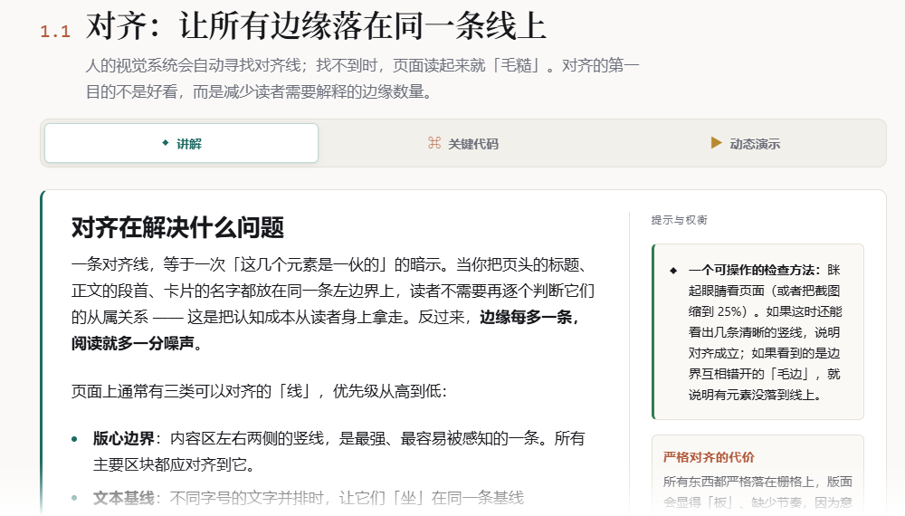
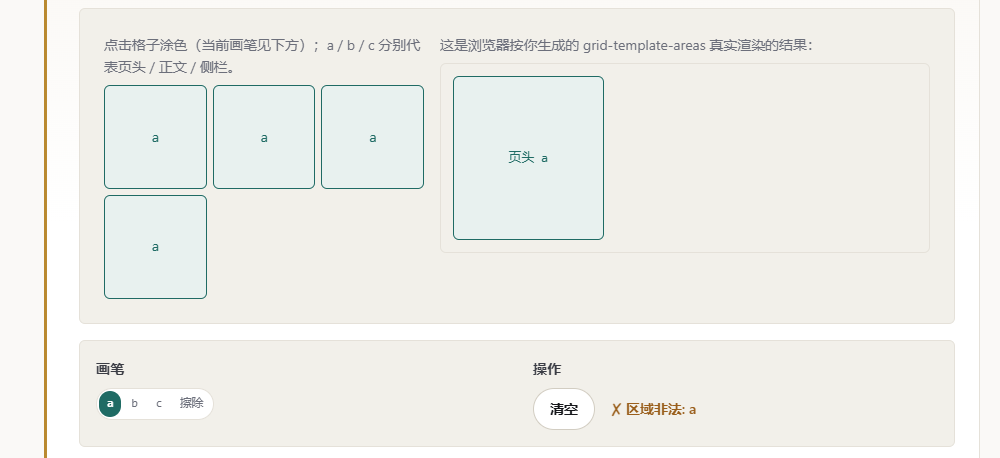
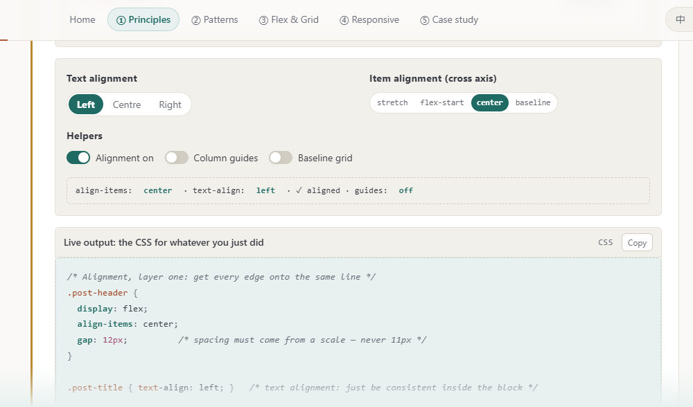
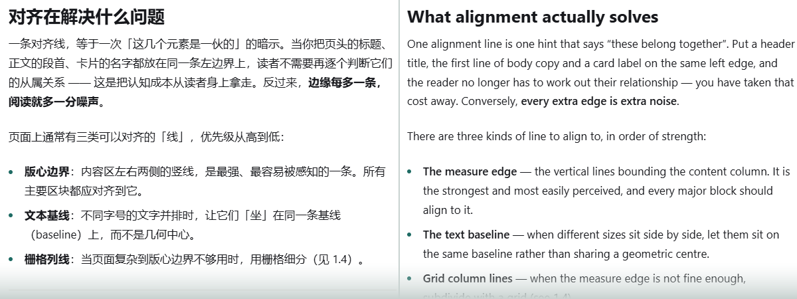
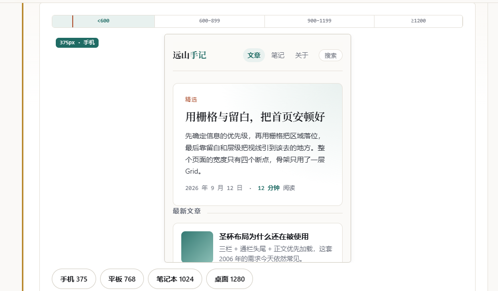

# 布局实验室 · Layout Lab —— 关键亮点

> 案例驱动的**页面布局**教学网站：讲原理、讲取舍、讲「为什么这样排更好」，而不是罗列 CSS 属性。
> 每个知识点都由 **讲解 / 关键代码 / 动态演示** 三块组成，全站中英双语、内容一致，
> 18 个演示全部是可动手的真实交互。

| | |
| --- | --- |
| **在线地址** | https://wangling1206.github.io/layout-lab-course/ |
| **源码仓库** | https://github.com/WangLing1206/layout-lab-course |
| **技术栈** | 原生 HTML / CSS / JavaScript —— 无框架、无构建步骤、无第三方依赖 |
| **规模** | 5 章 · 18 个知识点 · 18 个可交互演示 · 双语词条 911 条 · 约 12,100 行源码 |

「布局实验室」是一份围绕「如何做好页面布局」的教程：讲原理、讲取舍、讲为什么这样排更好，
而不是罗列 CSS 属性。全站 5 章、18 个知识点、18 个可交互演示，中英双语；
正文里的每一条结论，都能在页面上动手验证。

---

## 01　案例驱动：五章讲完一个首页的改造

全站只用「远山手记」这一个博客首页作例子——它改造前「能用但不好读」：
没有版心，行宽随窗口无限拉长；三栏写死，窄屏挤成一团；标题与正文同级，间距随手给。

五章分别解决它的一个阶段（需求 → 骨架 → 实现 → 响应式 → 精修），前一步的结论就是后一步的依据。
布局知识本身是碎的（对齐、间距、断点彼此独立），只有放进一条完整的决策链，
读者才能看到「选择 A 会导致什么后果」。


*「远山手记」博客首页：改造前没有版心，行宽随窗口拉长、三栏写得死死的；改造后是 1180px 版心 + 四档断点 + 一条统一间距刻度。*

## 02　每个知识点固定「讲解 / 关键代码 / 动态演示」

三块等宽切换，而不是从上到下堆叠——想看演示不必先滚过整段代码，切换选择还会在后续知识点之间记住。
无 JS 时切换器自动隐藏，三块按原顺序堆叠，内容一点不丢。

讲解面板本身是「正文列 + 旁注栏」的编辑型双栏：正文受 68ch 行宽上限约束，
不为了填满容器而把行拉长，提示与权衡移到右侧旁注栏。


*知识点 1.1：正文标题下的三栏切换器，以及讲解面板的「正文列 + 旁注栏」双栏。*

## 03　18 个演示全部是可动手的真实交互

滑块、分段按钮、开关、可点击画板，没有一处截图或 GIF。

以画笔为例：在 3×3 画板上涂色，它会实时校验同名区域是否构成矩形——
CSS 规定同名单元格必须拼成一块完整矩形，否则整条 `grid-template-areas` 会被丢弃。
非法时预览立刻散架，代码里同时写明原因与后果。


*知识点 3.3 的 grid-template-areas 画笔：涂成 L 形后立刻提示「区域非法」，右侧预览随之散架。*

## 04　演示下方是「跟着你重写的 CSS」

每个演示都配一块实时输出，跟着你的每一次拖动与点击同步重写等价 CSS；参数调满意就能直接复制走。
演示区给出的从来不是效果，而是能用的代码——这把「动手玩」和「拿到代码」之间的落差抹掉了。


*英文模式下的动态演示：控件、读数与下方的实时输出同步重写，注释也已切换为英文。*

## 05　中英双语，两种语言内容一致

一键切换后，正文、控件标签、代码注释、演示读数、乃至实时输出里的注释全部同步。

难点在于那些注释嵌着动态数值（px、断点名、列数），中英语序不同，不能靠字符串拼接，
必须把整句作为词条并用占位符取值。全站 911 条词条，自检 0 漏译。


*同一个知识点、同一块内容的中文版与英文版：正文、控件、代码注释、演示读数全部同步。*

## 06　网站本身就是所讲方法的示范

原生 HTML / CSS / JavaScript，无框架、无构建步骤。Grid 搭整站骨架、Flex 排每一排零件、
`clamp()` 做流体字号，`sticky` 都配了 `align-self: start`。

容器查询用在两处真实场景：第 4 章的对照演示，以及讲解面板自身——
面板只在容器 ≥860px 时才把旁注栏并排到正文右侧。


*知识点 4.1 的视口模拟器：拖动宽度后，真实 iframe 按媒体查询把成品重排为单栏，断点标尺同步高亮当前档位。*

---

## 速览 · 18 个演示分布在五章

| 章 | 知识点 | 演示与交互方式 |
| --- | --- | --- |
| ① 设计原则 | 对齐 · 留白 · 层级 · 栅格 | 对齐开关与参考线 · 间距刻度滑块 · 层级比例尺 · 12 栅格实时重建 |
| ② 经典模式 | 单栏行宽 · 五种布局 · F/Z 形 | 行宽测量 · 五种模式一键切换并对比 Grid 与 Flex · 扫读路径动画 |
| ③ Flex 与 Grid | 轴 · 轨道与 fr · 命名区域 · 选型 | Flex 试验台 · Grid 试验台 · areas 画笔（实时校验矩形合法性）· 选型决策器 |
| ④ 响应式 | 断点 · 流体排版 · 容器查询 | 拖动视口看真实 iframe 重排 · clamp() 试验台 · 容器查询与媒体查询并排对照 |
| ⑤ 案例实战 | 需求 · 骨架 · 实现 · 精修 | 线框增删 · 三套骨架对比 · 成品预览（375/768/1024/1280）· 改造前后对比与验收清单 |

## 速览 · 本站如何示范所讲的方法

| 技术 | 用在哪里 | 技术 | 用在哪里 |
| --- | --- | --- | --- |
| CSS 自定义属性 | 颜色 / 间距 / 字号统一收在 tokens.css，暗色主题只换令牌 | Grid | 整站骨架、切换器、卡片阵列、案例骨架与断点重排 |
| Flexbox | 顶栏、控件行、开关组、卡片内部、页脚；靠边用 auto margin | clamp() | 字号刻度全是流体值，320 → 1600px 之间没有断层 |
| 容器查询 | 第 4 章对照演示；以及讲解面板自身（≥860px 并排旁注栏） | 逻辑属性 | margin / padding / border-inline 全站使用，天然支持 RTL |
| 无障碍 | 语义化标签、skip-link、焦点环、aria-live 播报、减少动效偏好 | position: sticky | 顶栏、章节目录、案例侧栏，一律配 align-self: start |

**实测**：6 个页面渲染正常 · 18 个演示全部可交互 · 双语 911 词条 0 漏译 · 全站 0 个 404

---

## 目录结构

```
.
├─ index.html                    首页（站点说明 + 案例主线 + 章节入口）
├─ chapters/                     5 章正文：设计原则 / 经典模式 / Flex & Grid / 响应式 / 案例实战
├─ assets/
│  ├─ css/                       tokens · base · site · demos
│  ├─ js/                        ui（控件工具箱）· i18n（双语引擎）· site · 5 个演示模块
│  └─ demo/                      案例成品与流体排版演示（可独立打开）
├─ tools/
│  ├─ check-i18n.mjs             双语完整性检查（漏译时非零退出，可用于 CI）
│  ├─ capture-figures.py         抓取本文档用的插图（Playwright 驱动本机 Chrome）
│  └─ build-highlights-docx.py   生成这份说明文档（DOCX，再由 LibreOffice 导出 PDF）
└─ README.md                     项目说明（功能清单 / 技术决定 / 已知边界）
```

## 本地运行与校验

```bash
python -m http.server 8000      # 不要用 file:// 打开，iframe 演示需要 http 环境
node tools/check-i18n.mjs       # 双语完整性检查
```

---

*本项目为课程作业，可自由用于学习与教学。案例中的博客「远山手记」为虚构示例。*
