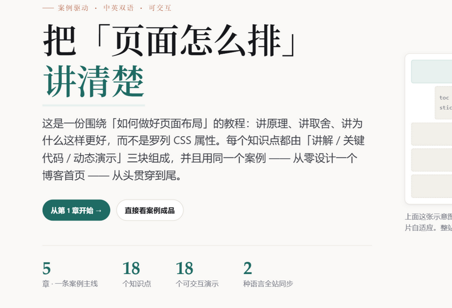
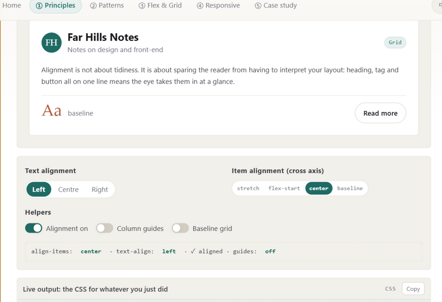
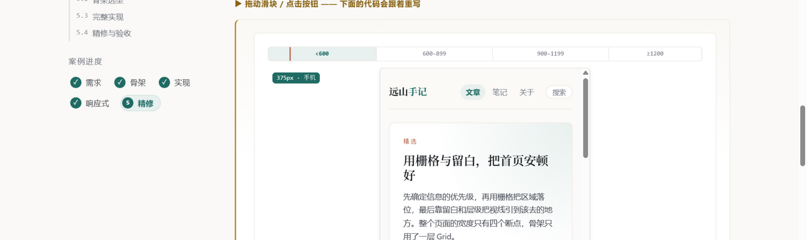

# 布局实验室 · Layout Lab —— 关键亮点

> 案例驱动的**页面布局**教学网站：讲原理、讲取舍、讲「为什么这样排更好」，而不是罗列 CSS 属性。
> 每个知识点都由 **讲解 / 关键代码 / 动态演示** 三块组成，全站中英双语、内容一致，
> 18 个演示全部是可动手的真实交互。

| | |
| --- | --- |
| **在线地址** | https://wangling1206.github.io/layout-lab-course/ |
| **源码仓库** | https://github.com/WangLing1206/layout-lab-course |
| **技术栈** | 原生 HTML / CSS / JavaScript —— 无框架、无构建步骤、无第三方依赖 |
| **规模** | 5 章 · 18 个知识点 · 18 个可交互演示 · 双语词条 911 条 · 约 12,100 行源码 |


*首页｜一条案例主线贯穿五章；右上示意图就是本站真实骨架*

---

## 6 个核心亮点

### 01　案例驱动：五章讲完一个首页的改造

全站只用「远山手记」这一个博客首页作例子——它改造前「能用但不好读」。
五章各解决一个阶段（需求 → 骨架 → 实现 → 响应式 → 精修），**前一步的结论就是后一步的依据**，
每章侧栏都显示案例进度。布局知识本身是碎的，只有放进一条完整的决策链里，
读者才能看到「选择 A 会导致什么后果」。

### 02　每个知识点固定「讲解 / 关键代码 / 动态演示」

三块**等宽切换**，而不是从上到下堆叠——想看演示不必先滚过整段代码，
切换选择还会在后续知识点之间记住。无 JS 时切换器自动隐藏，三块按原顺序堆叠，内容一点不丢。
讲解面板本身是「正文列 + 旁注栏」的编辑型双栏：正文受 68ch 行宽上限约束，
不为了填满容器而把行拉长。

### 03　18 个演示全部是可动手的真实交互

滑块、分段按钮、开关、可点击画板，没有一处截图或 GIF。
例如 `grid-template-areas` 画笔会**实时校验同名区域是否构成矩形**，
非法时把原因和后果一并写进代码——这条 CSS 规则光看文档很难记住，涂一次就懂了。

### 04　演示下方是「跟着你重写的 CSS」

每个演示都配一块**实时输出**，跟着你的每一次拖动与点击同步重写等价 CSS，
参数调满意就能直接复制走。演示区给出的从来不是效果，而是能用的代码——
这把「动手玩」和「拿到代码」之间的落差抹掉了。

### 05　中英双语，两种语言内容一致

一键切换后，正文、控件标签、代码注释、演示读数、乃至**实时输出里的注释**全部同步。
难点在于那些注释嵌着动态数值（px、断点名、列数），中英语序不同，不能靠字符串拼接，
必须把整句作为词条并用占位符取值。全站 911 条词条，自检脚本 0 漏译。

### 06　网站本身就是所讲方法的示范

原生 HTML / CSS / JavaScript，无框架、无构建步骤。
Grid 搭整站骨架、Flex 排每一排零件、`clamp()` 做流体字号、
容器查询用在讲解面板自身、`sticky` 都配了 `align-self: start`——
上面每一条都能在仓库里逐条核对。


*知识点「动态演示」栏 + 下方实时输出（英文模式，注释同样已切换）*


*第 5 章案例成品预览｜拖动视口宽度到 375px，真实 iframe 按媒体查询重排为单栏*

---

## 目录结构

```
.
├─ index.html                    首页（站点说明 + 案例主线 + 章节入口）
├─ chapters/                     5 章正文：设计原则 / 经典模式 / Flex & Grid / 响应式 / 案例实战
├─ assets/
│  ├─ css/                       tokens · base · site · demos
│  ├─ js/                        ui（控件工具箱）· i18n（双语引擎）· site · 5 个演示模块
│  └─ demo/                      案例成品与流体排版演示（可独立打开）
├─ tools/
│  ├─ check-i18n.mjs             双语完整性检查（漏译时非零退出，可用于 CI）
│  └─ build-highlights-docx.py   生成这份说明文档
└─ README.md                     项目说明（功能清单 / 技术决定 / 已知边界）
```

## 本地运行与校验

```bash
python -m http.server 8000      # 不要用 file:// 打开，iframe 演示需要 http 环境
node tools/check-i18n.mjs       # 双语完整性检查
```

---

*本项目为课程作业，可自由用于学习与教学。案例中的博客「远山手记」为虚构示例。*
